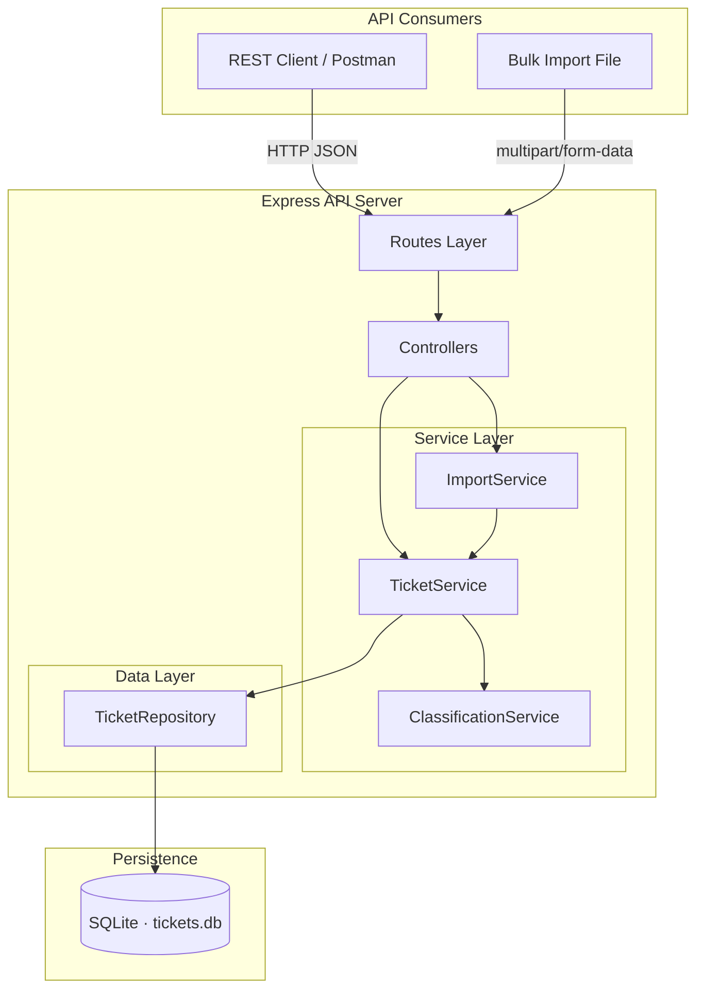
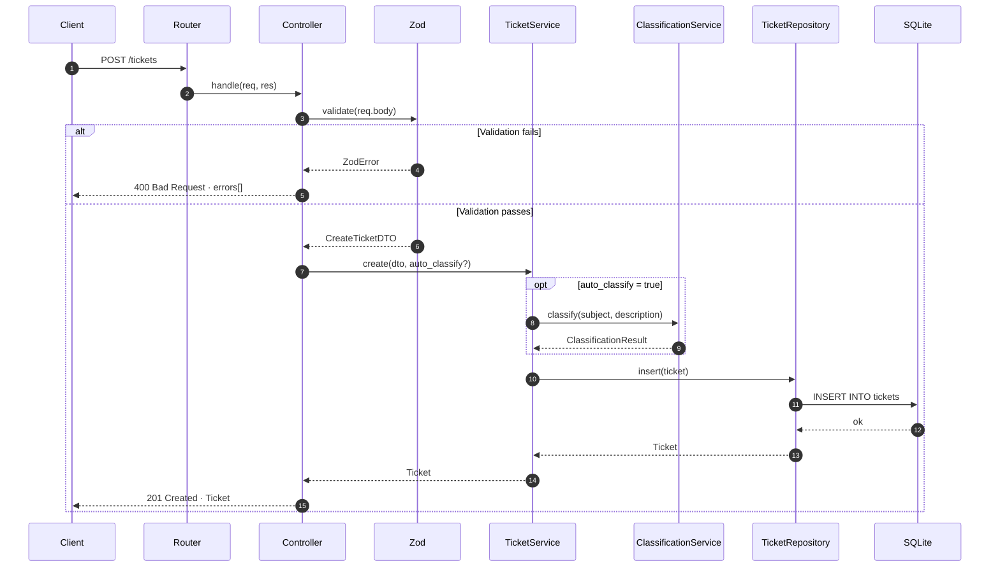
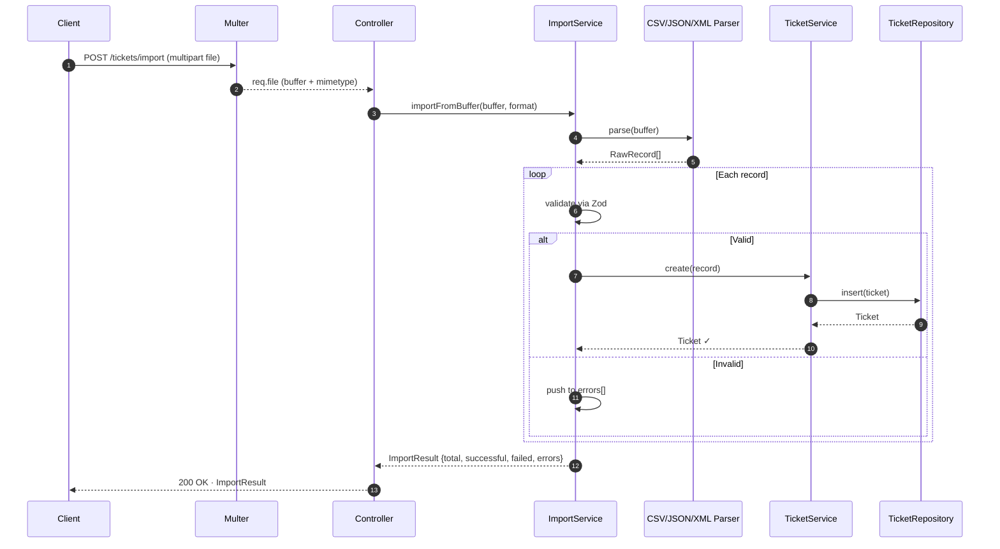
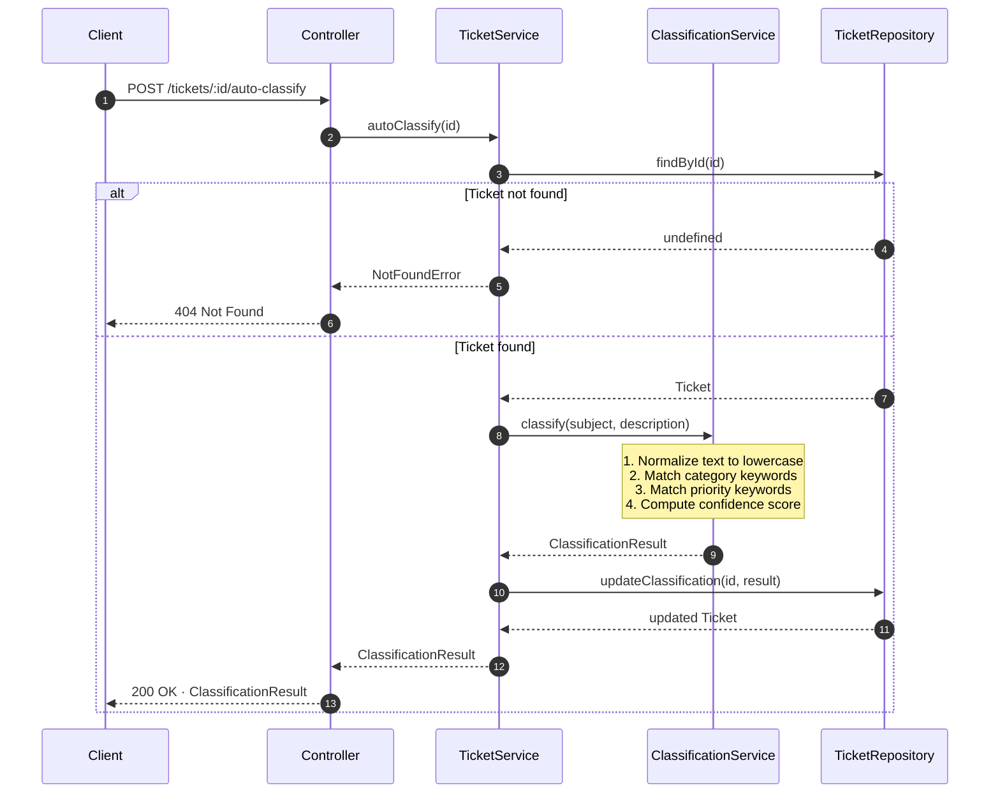

# Architecture: Intelligent Customer Support System

**Date:** 2026-05-04
**Stack:** Node.js · Express · TypeScript · SQLite (better-sqlite3) · Zod · Jest

---

## Table of Contents

1. [Functional Requirements](#functional-requirements)
2. [Non-Functional Requirements](#non-functional-requirements)
3. [High-Level Architecture Diagram](#high-level-architecture-diagram)
4. [Data Flow — Ticket Creation](#data-flow--ticket-creation)
5. [Data Flow — Bulk Import](#data-flow--bulk-import)
6. [Data Flow — Auto-Classification](#data-flow--auto-classification)
7. [Project Structure](#project-structure)
8. [Component Descriptions](#component-descriptions)
9. [Design Decisions & Trade-offs](#design-decisions--trade-offs)
10. [Security Considerations](#security-considerations)
11. [Performance Considerations](#performance-considerations)

---

## Functional Requirements

### Ticket Management
| ID | Requirement |
|----|-------------|
| FR-01 | Create a ticket with required fields: `customer_email`, `subject`, `description` |
| FR-02 | Retrieve a single ticket by UUID |
| FR-03 | List all tickets with optional filtering by `status`, `category`, `priority`, `assigned_to` |
| FR-04 | Update any mutable ticket field; `id` and `created_at` are immutable |
| FR-05 | Delete a ticket permanently |
| FR-06 | Setting `status` to `resolved` automatically populates `resolved_at` timestamp |

### Bulk Import
| ID | Requirement |
|----|-------------|
| FR-07 | Accept file upload in CSV, JSON, or XML format via `multipart/form-data` |
| FR-08 | Validate every record independently — invalid records are skipped, valid ones are saved |
| FR-09 | Return import summary: `total`, `successful`, `failed`, and per-record error details |
| FR-10 | Reject unrecognised file formats with `415 Unsupported Media Type` |
| FR-11 | Return meaningful parse errors for malformed files (e.g. broken CSV structure) |

### Auto-Classification
| ID | Requirement |
|----|-------------|
| FR-12 | Classify a ticket's `category` and `priority` from `subject` + `description` via keyword matching |
| FR-13 | Return `confidence` (0–1), `reasoning` string, and matched `keywords` with every classification result |
| FR-14 | Expose explicit classification endpoint: `POST /tickets/:id/auto-classify` |
| FR-15 | Run classification automatically on ticket creation when `?auto_classify=true` query param is present |
| FR-16 | Persist `classification_confidence` alongside the ticket in the database |
| FR-17 | Allow manual override of `category` and `priority` via `PUT /tickets/:id` at any time |
| FR-18 | Log every classification decision (ticket id, category, priority, confidence, keywords) to console |

---

## Non-Functional Requirements

### Performance
| ID | Requirement |
|----|-------------|
| NFR-01 | API must handle 20+ simultaneous concurrent requests without data corruption or errors |
| NFR-02 | Bulk import of 50+ records must complete within a single database transaction for atomicity and speed |
| NFR-03 | Classification must complete in under 5 ms per ticket (pure in-memory, no I/O) |
| NFR-04 | List filtering must execute in SQL (`WHERE` clause), not in application memory |

### Reliability
| ID | Requirement |
|----|-------------|
| NFR-05 | A validation failure on one import record must not affect other records in the same batch |
| NFR-06 | All unhandled exceptions must be caught by a global error handler — server must not crash on bad input |
| NFR-07 | Appropriate HTTP status codes must be returned for all error cases (400, 404, 415, 500) |

### Security
| ID | Requirement |
|----|-------------|
| NFR-08 | File uploads limited to 10 MB; only `text/csv`, `application/json`, `text/xml` MIME types accepted |
| NFR-09 | All SQL queries use prepared statements — no string interpolation |
| NFR-10 | Stack traces and internal error details must never appear in HTTP response bodies |

### Maintainability
| ID | Requirement |
|----|-------------|
| NFR-11 | Test suite must achieve >85% code coverage across all source files |
| NFR-12 | Classification logic must be isolated in its own service, independently testable without HTTP |
| NFR-13 | Database access must be isolated in the repository layer — services never write raw SQL |

---

## High-Level Architecture Diagram



---

## Data Flow — Ticket Creation



---

## Data Flow — Bulk Import



---

## Data Flow — Auto-Classification



---

## Project Structure

```
homework-2/
├── src/
│   ├── server.ts                  # HTTP server entry point
│   ├── app.ts                     # Express app factory (used by tests)
│   ├── db/
│   │   ├── database.ts            # SQLite connection singleton
│   │   └── migrations.ts          # CREATE TABLE statements
│   ├── types/
│   │   └── ticket.types.ts        # Zod schemas + inferred TypeScript types
│   ├── routes/
│   │   └── tickets.routes.ts      # All route declarations
│   ├── controllers/
│   │   └── tickets.controller.ts  # HTTP request/response handling
│   ├── services/
│   │   ├── ticket.service.ts      # CRUD + orchestration
│   │   ├── classification.service.ts  # Keyword classification engine
│   │   └── import.service.ts      # CSV / JSON / XML parsing
│   ├── repositories/
│   │   └── ticket.repository.ts   # All SQL statements
│   └── utils/
│       └── errors.ts              # AppError, NotFoundError, ValidationError
├── tests/
│   ├── fixtures/                  # Sample CSV / JSON / XML files
│   ├── test_ticket_api.test.ts
│   ├── test_ticket_model.test.ts
│   ├── test_import_csv.test.ts
│   ├── test_import_json.test.ts
│   ├── test_import_xml.test.ts
│   ├── test_categorization.test.ts
│   ├── test_integration.test.ts
│   └── test_performance.test.ts
├── docs/
│   ├── adr/
│   │   └── ADR-001-technology-choices.md
│   ├── ARCHITECTURE.md            # This file
│   ├── API_REFERENCE.md
│   └── TESTING_GUIDE.md
├── package.json
├── tsconfig.json
└── jest.config.ts
```

---

## Component Descriptions

### Routes (`src/routes/tickets.routes.ts`)
Declares URL patterns and attaches middleware. No business logic — delegates entirely to controllers. Multer middleware is attached here only for the `/import` route.

### Controllers (`src/controllers/tickets.controller.ts`)
Parses and validates the HTTP request using Zod, calls the appropriate service method, and formats the HTTP response. The controller knows about HTTP (status codes, headers); services do not.

### TicketService (`src/services/ticket.service.ts`)
Owns all ticket business logic: enforcing immutable fields on update, calling ClassificationService when `auto_classify=true`, setting default `status=new` on creation. Does not construct SQL — delegates to TicketRepository.

### ClassificationService (`src/services/classification.service.ts`)
Pure function — given subject and description strings, returns a `ClassificationResult`. No database access. Keyword matching runs on lowercased concatenated text. Confidence score is the ratio of matched keywords to the total keyword set for the winning category. All decisions are logged via `console.debug`.

### ImportService (`src/services/import.service.ts`)
Parses CSV/JSON/XML buffers, validates records via `CreateTicketSchema`, delegates individual inserts to `TicketService.create()`. Wraps the entire import loop in a single SQLite transaction via `getDb()` for bulk-insert performance (NFR-02).

### TicketRepository (`src/repositories/ticket.repository.ts`)
The single point of contact with SQLite for all ticket CRUD. All `better-sqlite3` prepared statements live here. Services do not import the database module directly, with one deliberate exception: `ImportService` calls `getDb()` to wrap its bulk-insert loop in a single transaction (NFR-02). Individual inserts within that transaction still go through `TicketService.create()`.

---

## Design Decisions & Trade-offs

### Classification in Service Layer
**Decision:** `ClassificationService` lives under `src/services/`, not in a route handler or controller.
**Reasoning:** Classification logic needs to be called from two places — `POST /tickets` (with `auto_classify=true`) and `POST /tickets/:id/auto-classify`. Keeping it in the service layer avoids duplication and makes it independently testable without HTTP overhead.

### app.ts vs server.ts Split
**Decision:** Express app is created in `app.ts` (exported); `server.ts` calls `app.listen()`.
**Reasoning:** Supertest imports `app` directly and binds its own ephemeral port. If the server started itself on import, test parallelism would cause port conflicts.

### Synchronous SQLite
**Decision:** `better-sqlite3` (sync) over `sqlite3` (async/callback) or `Drizzle ORM`.
**Reasoning:** Async DB calls in Express require careful error propagation. `better-sqlite3`'s sync API is simpler, and SQLite's single-writer model means async would not improve throughput anyway. An ORM adds abstraction cost with no benefit at this scale.

### Zod at Controller Boundary Only
**Decision:** Zod validation runs in controllers, not in services.
**Reasoning:** Services are called internally (e.g., `ImportService` calling `TicketService`). Validating again inside services would double-validate data that's already been checked, or require services to handle raw unvalidated input. Validation belongs at the system boundary.

---

## Security Considerations

| Concern | Mitigation |
|---------|-----------|
| File upload abuse | `multer` configured with `fileSize` limit (10 MB). Only `text/csv`, `application/json`, `text/xml` MIME types accepted. |
| SQL injection | `better-sqlite3` prepared statements with `?` placeholders — no string interpolation in queries. |
| Input validation | All inbound data validated with Zod before reaching service layer — malformed payloads rejected at controller with 400. |
| Large XML payloads | `fast-xml-parser` configured with entity expansion limits to prevent billion-laughs attack. |
| Error leakage | Production error handler returns generic messages; stack traces only logged internally, never in response body. |

---

## Performance Considerations

| Concern | Approach |
|---------|---------|
| Concurrent writes (Task 5) | `better-sqlite3` serializes writes via SQLite's single-writer lock — safe under concurrent load, no additional locking needed. |
| Bulk import throughput | Import runs in a single SQLite transaction — wrapping N inserts in `BEGIN/COMMIT` is 10–100× faster than N individual auto-committed inserts. |
| Classification speed | Pure in-memory keyword matching, O(n) over keyword sets. No I/O, no external calls — sub-millisecond per ticket. |
| Query filtering | `GET /tickets` filters applied in SQL `WHERE` clause, not in JavaScript after fetching all rows. Index on `status` and `category` columns. |
