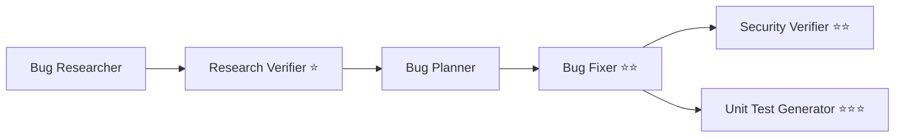

# Homework 4 — 4-Agent Bug-Fixing Pipeline

**Author / Student:** Andrii Kurbatov (andrii.kurbatov@techmagic.co)
**Course:** GenAI and Agentic AI for Software Engineering

A single-command, multi-agent pipeline that researches, verifies, fixes, security-reviews, and
tests bugs in a small sample application — with each agent assigned an explicit model appropriate
to its task.

---

## What this does

The pipeline operates on a deliberately buggy **Expense Tracker REST API** (`src/`). One command
runs six agents in order; each reads the previous agent's artifact and writes its own:



| # | Agent | File | Reads | Writes |
|---|-------|------|-------|--------|
| 1 | Bug Researcher | `agents/bug-researcher.agent.md` | `bug-context.md`, `src/` | `research/codebase-research.md` |
| 2 | **Research Verifier** ⭐ | `agents/research-verifier.agent.md` | `codebase-research.md`, `src/` | `research/verified-research.md` |
| 3 | Bug Planner | `agents/bug-planner.agent.md` | `verified-research.md` | `implementation-plan.md` |
| 4 | **Bug Fixer** ⭐⭐ | `agents/bug-fixer.agent.md` | `implementation-plan.md` | `fix-summary.md` + edited `src/` |
| 5 | **Security Verifier** ⭐⭐ | `agents/security-verifier.agent.md` | `fix-summary.md` + changed files | `security-report.md` |
| 6 | **Unit Test Generator** ⭐⭐⭐ | `agents/unit-test-generator.agent.md` | `fix-summary.md` + changed files | `tests/*.test.ts` + `test-report.md` |

Agents 2–6 cover Tasks 1–4 of the assignment (Research Verifier, Bug Fixer, Security Verifier, Unit
Test Generator are the four required agents). Bug Researcher and Bug Planner are supporting stages
that produce the inputs the required agents consume.

---

## Single-command execution

```bash
npm install
npm run pipeline      # == bash run-pipeline.sh
```

`run-pipeline.sh` drives each agent via Claude Code headless mode (`claude -p`). For every stage it
reads the agent's `model:` from frontmatter, uses the agent body as the system prompt, **auto-loads
the agent's related skill** (appended to the system prompt), and passes a concrete task. No manual
per-agent invocation is required between steps.

---

## Per-agent model selection & justification

Each agent declares its model in its `*.agent.md` frontmatter. The split follows the assignment's
guidance — stronger reasoning models for verification/analysis, a faster model for routine
execution.

| Agent | Model | Why |
|-------|-------|-----|
| Bug Researcher | `claude-opus-4-8` | Locating root causes across files is open-ended reasoning; accuracy here gates the whole pipeline. |
| **Research Verifier** | `claude-opus-4-8` | Fact-checking every reference/snippet and grading quality demands the strongest reasoning. |
| Bug Planner | `claude-sonnet-4-6` | Translating verified findings into before/after diffs is structured and well-scoped. |
| **Bug Fixer** | `claude-sonnet-4-6` | Applying a precise plan + running tests is routine execution — fast/cheaper is appropriate. |
| **Security Verifier** | `claude-opus-4-8` | Security review needs the deepest reasoning to catch injection/secret/validation issues. |
| **Unit Test Generator** | `claude-sonnet-4-6` | Test scaffolding against a clear spec (FIRST) is well-defined work. |

---

## Skills

- **`skills/research-quality-measurement.md`** (Task 1.2) — defines research-quality levels
  (L0–L4) and the required sections for `verified-research.md`. Loaded automatically for the
  Research Verifier.
- **`skills/unit-tests-FIRST.md`** (Task 4.2) — defines **F**ast, **I**ndependent, **R**epeatable,
  **S**elf-validating, **T**imely and the test-report format. Loaded automatically for the Unit
  Test Generator.

---

## Sample application (Task 5)

A minimal **Expense Tracker REST API** (Express + TypeScript, in-memory store). Seeded issues:

| ID | Kind | Location | Issue |
|----|------|----------|-------|
| BUG-001 | Functional | `src/store.ts` | `maxAmount` query string compared to numeric amount → wrong filtering |
| BUG-002 | Functional | `src/app.ts` | unknown expense id returns `200` empty instead of `404` |
| SEC-001 | Security | `src/app.ts` | `/expenses/filter?expr=` runs user input through `eval()` (CWE-95 RCE) |

Details and fix directions: `context/bugs/001/bug-context.md`. **Before** the pipeline these exist;
**after** the pipeline they are fixed, tests pass, and generated unit tests guard against regression.

### Run / test the app directly

```bash
npm run dev      # start API on http://localhost:3000
npm test         # Jest
```

See `demo/sample-requests.http` for example calls (including the buggy/vulnerable cases).

---

## Architecture decisions

- **Markdown agents + shell orchestration.** Agents are declarative `*.agent.md` files (frontmatter
  = model + I/O contract, body = system prompt). A thin `run-pipeline.sh` sequences them. This keeps
  the "multi-agent system" portable and inspectable, and makes per-agent model choice explicit.
- **Artifact hand-off.** Every stage communicates only through files in `context/bugs/001/`, so the
  pipeline is resumable and each step's output is auditable.
- **Skills as loadable rubrics.** Skills are plain markdown injected into the relevant agent's
  system prompt at runtime, satisfying "loads their related skills automatically."
- **In-memory store, minimal deps.** Keeps the sample app runnable in a couple of commands and small
  enough to fully fix in one pipeline run.

---

## AI tools used

- **Claude Code** (Opus 4.8 / Sonnet 4.6) — scaffolding, agent/skill authoring, and as the runtime
  that executes every pipeline stage.
- Verification of generated fixes and tests via `npm test` (the human-in-the-loop gate).

---

## Project structure

```
homework-4/
├── README.md                # this file
├── HOWTORUN.md
├── CHECKLIST.md             # task breakdown
├── run-pipeline.sh          # single-command pipeline
├── package.json / tsconfig.json / jest.config.ts
├── agents/                  # 6 agent definitions (4 required + 2 supporting)
├── skills/                  # research-quality-measurement.md, unit-tests-FIRST.md
├── context/bugs/001/        # bug-context.md + pipeline artifacts (generated)
│   ├── bug-context.md
│   ├── research/            # codebase-research.md, verified-research.md
│   ├── implementation-plan.md
│   ├── fix-summary.md
│   ├── security-report.md
│   └── test-report.md
├── src/                     # sample app (seeded bugs + security issue)
├── tests/                   # smoke test + generated unit tests
├── demo/                    # run.sh, sample-requests.http
└── docs/screenshots/        # pipeline run, fixes, security scan, tests
```
